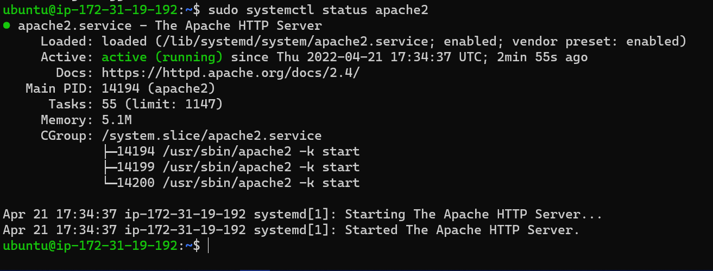
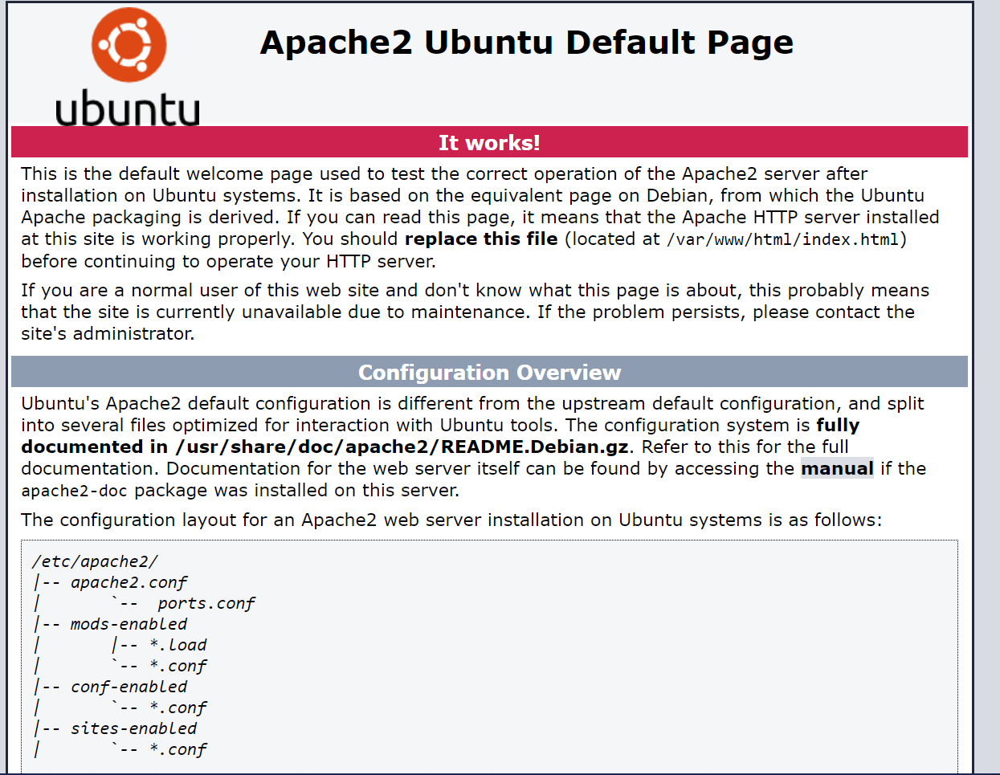
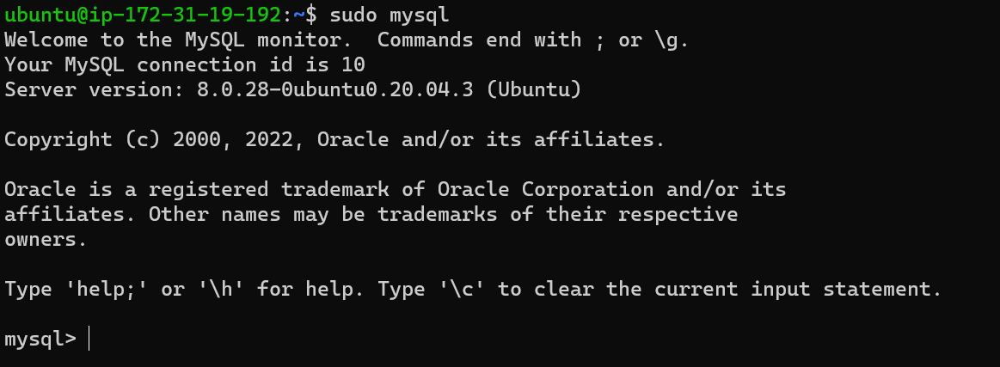
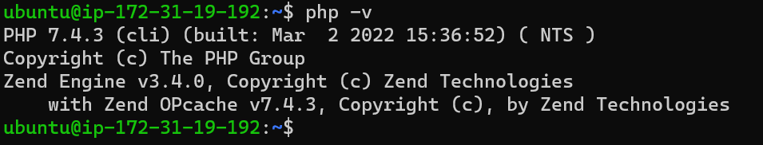
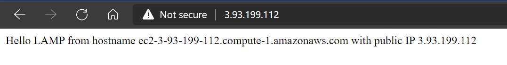
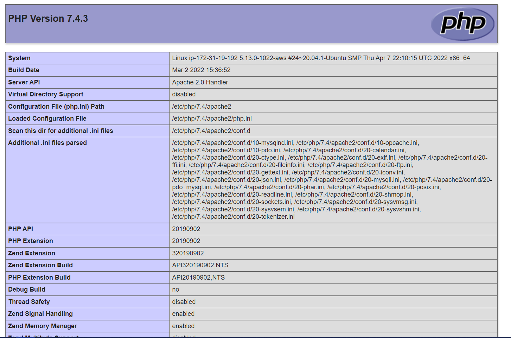

# Documentation of Project 1
## Step 1: Installing Apache and Updating the Firewall

- Update a list of packages in the package manager with `sudo apt update`
- Run apache2 package installation with `sudo apt install apache2`
- Verify that apache2 is running as a service in the OS using `sudo systemctl status apache2`

- Check how you can access the server locally in the Ubuntu shell by running `curl http://localhost:80` or `curl http://127.0.0.1:80`
-  Add a rule to EC2 configuration to open inbound connection through port 80
- Now test how the Apache HTTP server can respond to requests from the Internet. Open a web browser of your choice and try to access
http://< Public-IP-Address >:80

## Step 2: Installing MySQL
- Use ‘apt’ to acquire and install this software via `sudo apt install mysql-server`
- Run security script that comes pre-installed with MySQL by running `sudo mysql_secure_installation`
- Test if you’re able to log in to the MySQL console by typing `sudo mysql`

- To exit the MySQL console, type `exit`

## Step 3: Installing PHP
- To install the PHP package along with php-mysql (a PHP module that allows PHP to communicate with MySQL-based databases) and libapache2-mod-php (to enable Apache to handle PHP files), run `sudo apt install php libapache2-mod-php php-mysql`
- Once the installation is finished, confirm PHP version using `php -v`

- LAMP stack is now completely installed and fully operational.

## Step 4: Creating a Virtual Host for Your Website Using Apache
- Create the directory for projectlamp using ‘mkdir’ command `sudo mkdir /var/www/projectlamp`
- Assign ownership of the directory with your current system user via `sudo chown -R $USER:$USER /var/www/projectlamp`
- Create and open a new configuration file in Apache’s sites-available directory using your preferred command-line editor, using vi or vim (They are the same by the way) via `sudo vi /etc/apache2/sites-available/projectlamp.conf`
- This will create a new blank file. Paste in the following bare-bones configuration by hitting on i on the keyboard to enter the insert mode, and paste the text:
`<VirtualHost *:80>
    ServerName projectlamp
    ServerAlias www.projectlamp 
    ServerAdmin webmaster@localhost
    DocumentRoot /var/www/projectlamp
    ErrorLog ${APACHE_LOG_DIR}/error.log
    CustomLog ${APACHE_LOG_DIR}/access.log combined
</VirtualHost>`
- To save and close the file, (1) Hit the esc button on the keyboard (2) Type : (3) Type wq. w for write and q for quit (4) Hit ENTER to save the file
- Use the ls command to show the new file in the sites-available directory via `sudo ls /etc/apache2/sites-available`
- Use a2ensite command to enable the new virtual host via `sudo a2ensite projectlamp`
-To disable Apache’s default website use a2dissite command , type `sudo a2dissite 000-default`
- To make sure your configuration file doesn’t contain syntax errors, run `sudo apache2ctl configtest`
- Reload Apache so these changes take effect via `sudo systemctl reload apache2`
- New website is now active, but the web root /var/www/projectlamp is still empty. Create an index.html file in that location so that we can test that the virtual host works as expected, using `sudo echo 'Hello LAMP from hostname' $(curl -s http://169.254.169.254/latest/meta-data/public-hostname) 'with public IP' $(curl -s http://169.254.169.254/latest/meta-data/public-ipv4) > /var/www/projectlamp/index.html`
- Go to your browser and try to open your website URL using IP address (http://< Public-IP-Address >:80) or public DNS name (http://< Public-DNS-Name >:80). The result is the same.

## Step 5: Enable PHP on the Website
- To change the default DirectoryIndex settings on Apache, a file named index.html from taking precedence over an index.php file, edit the /etc/apache2/mods-enabled/dir.conf file and change the order in which the index.php file is listed within the DirectoryIndex directive via `sudo vim /etc/apache2/mods-enabled/dir.conf` then
`<IfModule mod_dir.c>
        #Change this:
        #DirectoryIndex index.html index.cgi index.pl index.php index.xhtml index.htm
        #To this:
        DirectoryIndex index.php index.html index.cgi index.pl index.xhtml index.htm
</IfModule>`
- After saving and closing the file, you will need to reload Apache so the changes take effect via `sudo systemctl reload apache2`
- To create a PHP test script to confirm that Apache is able to handle and process requests for PHP files, create a new file named index.php inside your custom web root folder via `vim /var/www/projectlamp/index.php`
Add the following text, which is valid PHP code, inside the file:
`<?php
phpinfo();`
- Save and close the file, refresh the web page.

- After checking the relevant information about your PHP server through that page, remove the file created as it contains sensitive information about PHP environment and Ubuntu server: `sudo rm /var/www/projectlamp/index.php`

First real life project (deploying a LAMP stack website in AWS Cloud) complete!
